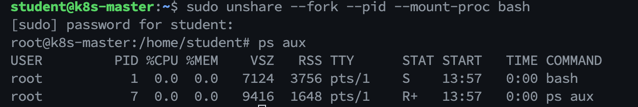
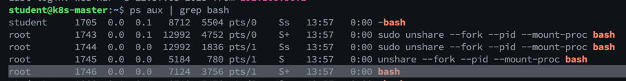
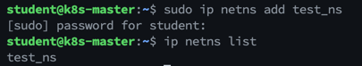
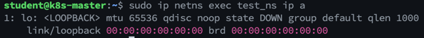
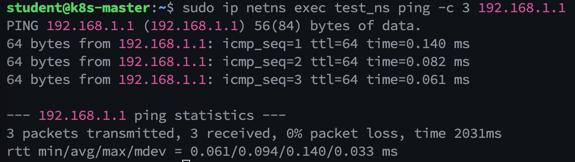

## 개요
컨테이너가 어떻게 독립적인 환경을 유지하는지 이해하기 위해, `네임스페이스`와 `croups` 개념을 알아야 합니다.

## 네임스페이스 (Namespaces)
리눅스 네임스페이스는 컨테이너가 마치 별도의 독립된 시스템처럼 동작할 수 있도록 하는 기술입니다.

### 1. 종류

| 네임스페이스  | 역할                               | 컨테이너 적용 사례                         |
|:--------|:---------------------------------|:-----------------------------------|
| PID     | 프로세스 ID를 분리하여 독립적인 프로세스 공간 제공    | 각 컨테이너 내부에서 PID 1이 init 프로세스 역할 수행 |
| Mount   | 컨테이너별로 독립적인 파일 시스템 제공            | 컨테이너 내부에서 호스트의 특정 디렉토리 마운트         |
| Network | 컨테이너마다 독립적인 네트워크 인터페이스 제공        | 컨테이너 간 통신을 위해 브리지 네트워크 사용          |
| UTS     | 컨테이너마다 개별적인 호스트네임 제공             | 컨테이너별로 서로 다른 hostname 사용           |
| IPC     | 컨테이너 간 공유 메모리 및 메시지 큐 분리         | 각 컨테이너의 공유 메모리 공간 분리               |
| User    | 컨테이너 내부의 사용자 ID와 호스트의 사용자 ID를 매핑 | 비루트(Non-root) 컨테이너 실행              |

### 2. 실습
#### 1) PID 네임스페이스 실습 - 프로세스 격리 확인
💡 목표: 네임스페이스를 이용해 별도의 프로세스 공간을 만들고, 격리 여부를 확인합니다.

1️⃣ 새로운 PID 네임스페이스 생성
```bash
unshare --fork --pid --mount-proc bash
```
- `unshare`: 새로운 네임스페이스를 생성하는 명령어
- `--fork`: 새로운 네임스페이스에서 새로운 프로세스를 실행
- `--pid`: PID 네임스페이스 생성
- `--mount-proc`: `/proc` 파일 시스템을 새롭게 마운트

2️⃣ 현재 프로세스 확인
```bash
ps aux
```
-> 네임스페이스 내부에서는 PID 1번이 새로 시작된 `bash` 프로세스가 됩니다.   
-> 호스트에서는 이 프로세스를 볼 수 있습니다.



3️⃣ 호스트에서 실행 중인 PID와 비교
```bash
ps aux | grep bash
```
-> PID가 서로 다름을 확인할 수 있습니다.   

---
#### 2) Network 네임스페이스 실습 - 네트워크 격리
💡 목표: 컨테이너와 유사하게 격리된 네트워크 환경을 구성하고 확인합니다.

1️⃣ 새로운 네트워크 네임스페이스 생성
```bash
ip netns add test_ns
```
-> `test_ns`라는 네임스페이스가 생성됨

2️⃣ 네트워크 네임스페이스 목록 확인
```bash
ip netns list
```
-> `test_ns`가 정상적으로 생성되었는지 확인   


3️⃣ 네트워크 인터페이스 확인
```bash
ip netns exec test_ns ip a
```


4️⃣ 네트워크 인터페이스 추가
```bash
ip link add veth0 type veth peer name veth1
ip link set veth1 netns test_ns
```
- veth0와 veth1이라는 가상 네트워크 인터페이스를 생성
- veth1을 test_ns 네트워크 네임스페이스로 이동

5️⃣ 네트워크 인터페이스 활성화
```bash
ip link set veth0 up
ip netns exec test_ns ip link set veth1 up
```
- 호스트와 네임스페이스 내부에서 각각 인터페이스를 활성화

6️⃣ IP 주소 할당
```bash
ip addr add 192.168.1.1/24 dev veth0
ip netns exec test_ns ip addr add 192.168.1.2/24 dev veth1
```
- veth0과 veth1에 각각 IP를 할당하여 통신 가능하도록 설정

7️⃣ 핑 테스트
```bash
ip netns exec test_ns ping -c 3 192.168.1.1
```
→ test_ns 내부에서 호스트의 veth0와 정상적으로 통신하는지 확인.
