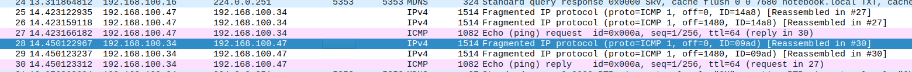

## 키워드

파편화, 서브넷팅, VPN, 터널링, IPSec, 라우팅 프로토콜 (RIP, OSPF, RGP 등), 

## 파편화

- 데이터 전송 시, IP 패킷의 크기가 MTU 보다 크면 조각으로 나뉘어 전송됨
  - MTU (Maximum Transmission Unit), 네트워크에 연결된 장치가 최대로 받아들일 수 있는 패킷 크기의 단위, 보통 1500바이트

예시:
```bash
ping -c1 -s4000 192.168.100.34
```

- `192.168.100.34` 로 4000바이트의 데이터를 한번 보내라.
- `-s`: 패킷 페이로드 크기 지정


이미지 (와이어 샤크 패킷 분석 이미지)   


- ip `192.168.100.47` 기기는 IPv4 또는 ICMP 프로토콜로 1514, 1514, 1082 크기의 패킷을 총 3번 전송
- ip `192.168.100.34` 기기는 파편화된 패킷을 3번에 걸쳐 수신
- 파편화 발생 시, More Fragment 비트와 Fragment Offset 필드 사용됨

### 서브넷팅

- 네트워크 주소를 효율적으로 사용하기 위해 나온 기술
- 효율성 외에도 보안성, 네트워크 성능 향상을 위해 사용
  - 브로드캐스트 도메인을 줄일 수 있기 때문에

#### 개념 연습문제로 이해 확인

```bash
192.168.10.0/24
```

네트워크 주소 = IP 주소 && 서브넷 마스크

- 네트워크 주소: 192.168.10.0
- 브로드캐스트 주소: 192.168.10.255
- 호스트 주소 범위: 192.168.10.1 ~ 192.168.10.254
- 디폴트 서브넷 마스크: 255.255.255.0

#### 서브넷팅 연습문제

## 문제 1
IP 주소 172.30.45.87와 서브넷 마스크 255.255.254.0이 주어졌을 때, 다음을 구하세요.

172.30.45.87:          1010 1100, 0001 1110, 0010 1101, 0101 0111
255.255.254.0     :    1111 1111, 1111 1111, 1111 1110, 0000 0000
1010 1100, 0001 1110, 0010 1100, 0000 0000

- 네트워크 주소: 172.30.44.0
- 브로드캐스트 주소: 172.30.45.255
- 서브넷에 포함된 총 호스트 수: 512개
- 사용 가능한 호스트 범위: 172.30.44.1 ~ 172.30.45.254
- CIDR 표기법: 172.30.44.0/23

## 문제 2
192.168.50.0/24 네트워크를 다음 요구사항에 맞게 VLSM으로 분할하세요.

1100 0000, 1010 1000, 0011 0010, 00]00 0000

- 회계팀: 30대의 컴퓨터  2^5      192.168.50.64 ~ 192.168.50.95      192.168.50.64/27
- 개발팀: 60대의 컴퓨터  2^6      192.168.50.0 ~ 192.168.50.63       192.168.50.0/26
- 마케팅팀: 25대의 컴퓨터  2^5    192.168.50.96 ~ 192.168.50.127     192.168.50.96/27
- 보안팀: 12대의 컴퓨터  2^4      192.168.50.128 ~ 192.168.50.143    192.168.50.128/28
- 서버룸: 5대의 서버   2^3        192.168.50.144 ~ 192.168.50.151    192.168.50.144/29

## 문제 3 빈칸을 채워주세요.

- IP 주소: 192.168.100.150
- 서브넷마스크: /27 (255.255.255.224)

1100 0000, 1010 1000, 0110 0100, 1001 0110
1111 1111, 1111 1111, 1111 1111, 1110 0000
1100 0000, 1010 1000, 0110 0100, 100]0 0000
- 네트워크 주소: 192.168.100.128
- 브로드캐스트 주소: 192.168.100.159
- 첫번째 주소: 192.168.100.129
- ㅇ마지막 주소: 192.168.100.158
- 전체 IP 주소: 32개
- 전체 HOST 주소: 30개

## VPN
- 외부 네트워크(공용 네트워크)를 통해 사설 네트워크를 확장하는 기술.
- 보안적으로 보호된 가상 터널은 형성
- 암호화, 터널링 기술 사용
- 예를 들면, 대기업의 서울 본사와 부산 지사 간 긴밀한 데이터를 주고받을 때
- 기밀성, 무결성, 인증 등을 요할 때 사용

### 터널링
- 서버와 클라이언트 간 데이터를 주고 받을 때 암호화를 거침
- 암호키 데이터를 암호화하기 때문에 데이터가 탈취 당해도 해독 불가 => 보안성 강화
- PPTP, L2TP, IPSec 프로토콜 존재

터널링 과정:
1. 원본 패킷을 새로운 헤더로 캡슐화하여 보호된 터널을 통해 전송
2. 터널의 반대쪽에서 원본 패킷을 디캡슐화하여 수신.
3. 데이터 보호를 위해 암호화 적용 가능.