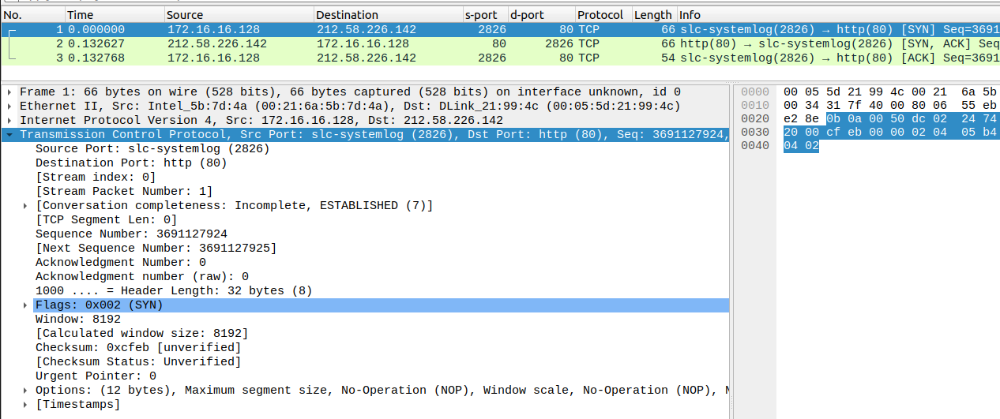

## 키워드

연결형/비연결형 통신, TCP, UDP, 3Way Handshake, 포트, 소켓, DHCP, SSL/TLS ...

## 4계층

- 연결형 통신: 데이터 송수신하기 전에 송수신자 간에 연결을 확인한 후 데이터를 주고받는 통신 방법.
- 비연결형 통신: 연결 확인 없이 데이터를 전달하는 통신 방법.
- TCP: 송수신자 간 열결을 확인한 후 데이터를 주고받는 연결형 통신 프로토콜로, 오류 제어, 흐름제어를 통해 신뢰성을 확보한다. UDP에 비해 속도가 느리다.
  - SACK(Selective Acknowledgement): 데이터 전송 오류 시, 전체 패킷을 재전송 하는 것이 아니라 오류가 발생한 패킷만 전송하는 기술
- UDP: 연결 확인 없이 데이터를 전송하는 프로토콜로, 연결과정이 없어 속도가 빠르지만, 데이터가 유실될 위험이 있다.

### 3Way Handshake

패킷 캡쳐 이미지

1. 클라이언트가 서버에게 연결을 요청한다. [SYN]
2. 서버는 클라이언트에게 [SYN + ACK] 플래그를 보낸다.
3. 클라이언트는 서버에게 [ACK] 플래그를 보낸다.

|   | 클라이언트                 | 서버                    |
|:--|:----------------------|:----------------------|
| 1 | SYN: 7924             |                       |
| 2 |                       | SYN: 9340 / ACK: 7925 |
| 3 | SYN; 7925 / ACK: 9341 |                       |

핵심은 각각 시퀀스 넘버와 요청넘버가 앞서 받은 숫자에 + 1이 더해진다는 점이다.

## 포트
서비스를 식별하는 번호를 의미한다. 
이전 3계층에서 IP 주소를 활용해 내 컴퓨터까지는 요청이 도착했다고 가정해보자. 
이때, 컴퓨터에 여러 실행중인 프로그램 중 어디에 해당 정보를 전달해야할까? 
이때, 필요한 것이 포트 번호이다. 메모리에서 실행중인 프로세스 중 포트번호를 이용해 해당 프로세스에 요청을 전달 할 수 있게 되는 것이다.

### 동적포트
Well-Known Port, Reserved Port 외에 사용자에게 동적으로 할당되는 포트를 의미한다. 

## 5계층

통신 세션을 관리하는 역할을 담당하는 계층으로, 소켓 프로토콜이 대표적이다. 
세션 설정, 유지, 종료 역할을 담당하는 계층이다.

## 6계층

## 7계층

### DHCP 프로토콜

IP 주소 및 네트워크 정보를 동적으로 할당해주는 프로토콜이다.

그림 첨부

1. DHCP 클라이언트는 DHCP 서버로 요청을 보낸다. [DELIVERY]
2. DHCP 서버는 정보를 담아 클라이언트에게 IP 주소 및 네트워크 정보를 제공한다. [OFFER]
3. DHCP 클라이언트는 서버로부터 전달받은 정보 중 사용할 정보를 담아 다시 서버에게 요청한다. [REQUEST]
4. DHCP 서버는 클라이언트의 요청을 기록하고 확인 메시지를 보낸다. [ACKNOWLEDGE]

#### DHCP 리스
클라이언트에 할당된 IP 주소 및 네트워크 구성 정보의 유효 기간을 의미한다. 
리스 기간이 만료되면 클라이언트는 갱신을 요청하게 된다.

### SSL/TLS
보안 통신 프로토콜, 디지털 인증서, CA 는 인증기관

### 암호화 방식

- 대칭키 암호화: 동일한 비밀키로 데이터를 암복호화 하는 방식. 키 분배 문제가 있음.
  - 알고리즘: AES, DES
- 비대칭키 암호화: 공개키와 비밀키를 통해 데이터를 암복호화 하는 방식. 키 분배의 어려움 해결. 처리 속도가 대칭키에 비해 느림.
  - 예시: 송신자를 A, 수신자를 B 라고 가정 
  - A: 공개키_A, 비밀키_A
  - B: 공개키_B, 비밀키_B
  - 이미 핸드쉐이크로 서로의 공개키를 주고 받은 상태라고 가정
  - A가 B의 공개키로 데이터를 암호화해서 전송
  - 데이터를 수신한 B는 자신의 비밀키로 데이터를 복호화하여 확인
  - 알고리즘: RSA, DSA, ECC
- 혼합 암호화: 키가 너무 무거워 자원 소모가 많으므로, 비대칭키 대칭키를 전달한 후, 실제 데이터는 대칭키 암호화 방식을 사용
- 깃헙은 더이상 RSA 방식을 지원하지 않음(자원 소모 많아서)

SSL/TLS 핸드쉐이크를 통해 공개키를 주고받음

그외 프로토콜: HTTP, HTTPS, FTP, SFTP, SSH, IMAP, POP3, SMTP 등

|  |  |       |
|:----  |:----  |:------|
|  |  |       |