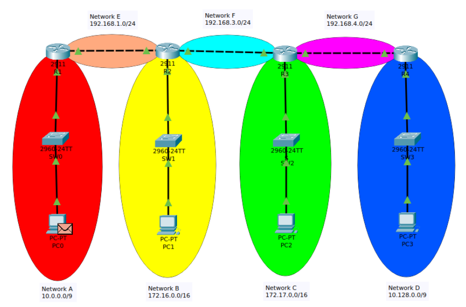

## 네트워크 인프라 구축 프로젝트 - 핵심 포인트

### 1. 네트워크 토폴로지 개요

이번 프로젝트는 네 대의 라우터(R1, R2, R3, R4)를 기반으로 구성된 동일한 토폴로지를 유지합니다.
각 라우터는 여러 인터페이스를 통해 10.0.0.0/9, 10.128.0.0/9, 172.16.0.0/16 등 다양한 서브넷에 연결되어,
총 7개의 네트워크 구역 간 통신이 가능하도록 설계되었습니다.

### 2. RIP 설정 시 유의사항 – auto-summary의 영향

- **기본 동작:**
  - RIP 프로토콜은 간단한 동적 라우팅 기능을 제공하지만, 기본적으로 활성화된 auto-summary 옵션이 있습니다.
- **auto-summary 문제점:**
  - auto-summary가 활성화된 경우, 서로 다른 서브넷(예: Network A인 10.0.0.0/9와 Network D인 10.128.0.0/9)이 클래스풀 주소(10.0.0.0/8)로 요약되어 처리됩니다.
  - 이로 인해 라우터는 두 네트워크를 구분하지 못하고, 잘못된 경로를 선택할 수 있어 일부 트래픽이 목적지에 도달하지 못할 위험이 있습니다.
- **해결 방안:**
  - 각 라우터에서 no auto-summary 명령어를 적용하여 주소 요약을 해제하면, 각 네트워크 구간이 명확하게 구분되어 올바른 경로 설정이 가능합니다.

### 3. OSPF와의 비교

- **OSPF의 특징:**공
  - **정밀한 네트워크 분할:** OSPF는 각 네트워크에 대해 서브넷 마스크와 와일드 마스크를 명시적으로 지정하여, 자동 요약 없이 정확한 경로 구분이 가능합니다.
  - **대규모 네트워크 효율성:** 대규모 네트워크 환경에서 빠른 covergence time과 안정적인 성능을 제공하지만, 설정 과정은 다소 복잡할 수 있습니다.

### 4. ACL 적용 방법과 의의

- **적용 방법:**
  - `access-list [번호]` 명령어를 통해 ACL을 정의한 후, 이를 특정 인터페이스에 적용합니다.
  - ACL은 IP 주소, 프로토콜, 포트 등을 기준으로 트래픽을 허용하거나 차단하는 규칙을 설정할 수 있습니다.
- *의의:**
  - 보안 강화: ACL을 통해 불필요하거나 위험한 트래픽을 차단함으로써 네트워크 보안을 강화할 수 있습니다.
  - **트래픽 제어:** 네트워크 관리자가 세밀한 제어를 통해 트래픽 흐름을 관리하고, 자원 사용을 최적화할 수 있습니다.

## 결론

해당 프로젝트를 통해 동일한 토폴로지 내에서 RIP 의 auto-summary 기능이 미치는 영향을 직접 확인하고, 
이를 해결하기 위한 no auto-summary 설정의 필요성을 학습하였습니다. 
또한, OSPF와 비교하여 각 프로토콜의 특성을 이해하고, ACL 적용을 통한 보안 강화 및 트래픽 제어의 중요성을 체험하으로써,
실제 운영 환경에서의 네트워크 최적화와 안정성 확보에 대해 인사이트를 얻을 수 있었습니다.

### 향후 과제

- OSPF area 구역을 다중으로 설정 후 ABR을 적용해 해결해봅니다.